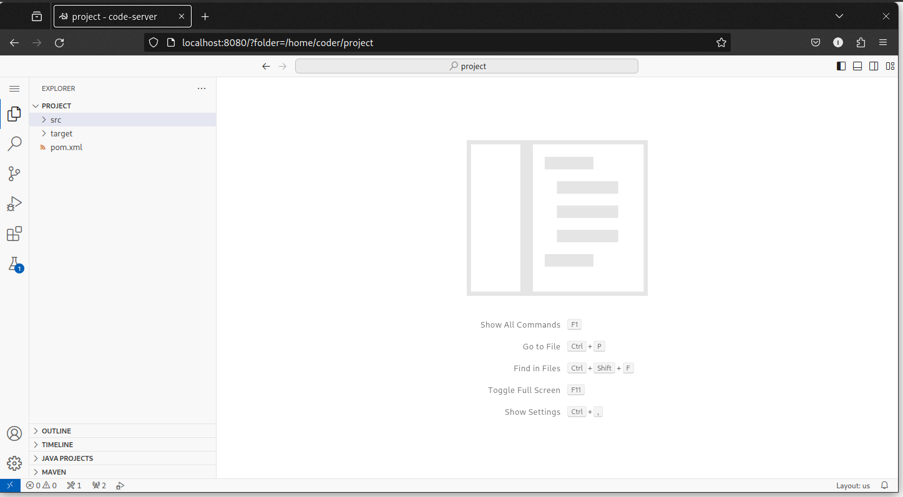
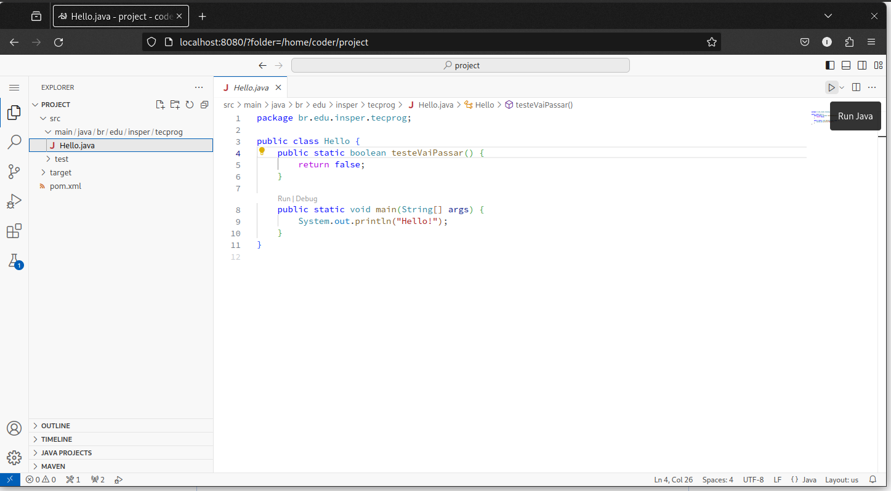
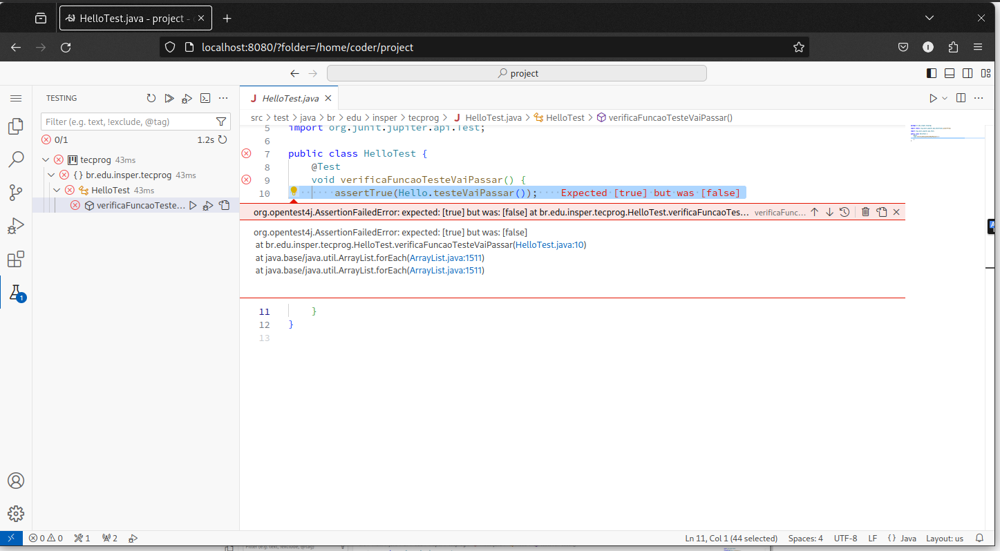
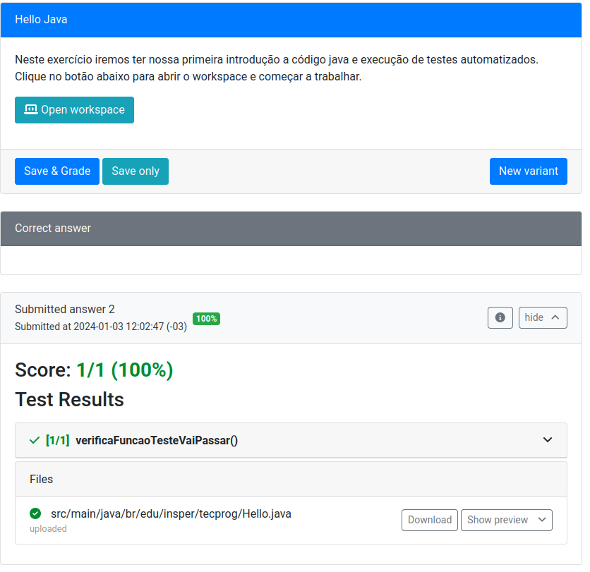

# Aula 00 — Primeiros passos

## 01 - Primeiro contato

Vamos aprender a ler o básico de código Java antes de iniciarmos os exercícios. Não é exatamente complicado, mas tem muito mais código que um programa básico em Python e isso às vezes assusta quem está começando. Vamos lá:

### A função `main`

```java
public class ClasseExemplo {
    public static void main (String args[]) {
        // aqui vai o código que é executado ao rodar o programa. 
    }
}
```

Muitos desses elementos já foram vistos em Python, só que agora tem um nome novo e explícito em Java.

1. `public class` define a criação de uma nova classe. Dentro de um arquivo podem ter várias classes, mas só uma dela pode ser `public`, que significa que ela é acessível para classes escritas em outros arquivos.
2. Em Java definimos escopo com `{ }`. Ou seja, tudo o que está entre as chaves que começam na linha 1 é parte da classe `ClasseExemplo`.
3. O código na função `main` é executado ao rodar o programa. 

### Argumentos de função e variáveis

Em Java temos uma caraterística muito importante: toda variável, argumento de função e valor de retorno de função deve ter seu tipo escrito *explicitamente* no código. 

| Tipo da variável | Nome do tipo em Java | Exemplo de declaração          |
| ---------------- | -------------------- | ------------------------------ |
| Inteiro          | `int`                | `#!java int valor = 5;`        |
| Fracionário      | `float` ou `double`              | `#!java double preco = 0.1;`    |
| Texto            | `String`             | `#!java String nome = "Igor";` |
| Booleano         | `boolean`            | `#!java boolean cond = false;` |

### Implementando uma função

Todos os nossos primeiros exercícios se resumirão a implementar uma única função em Java. Em geral eles seguirão o seguinte esqueleto, que já estará preenchido no código de suporte. 

```java
package br.edu.insper.tecprog.exemplos;

public class NomeDoExercicio {
    public static tipoRetorno funcao(tipo1 arg1, tipo2 arg2) {
        // faz algo aqui
    }
}
```

- Na primeira linha definimos um "pacote" em java. Isso equivale (em termos beeeem simplificados) à pasta em que o arquivo se encontra no projeto. Ou seja, o arquivo acima se chamaria `NomeDoExercicio.java` e estaria dentro da pasta `br/edu/insper/tecprog/exemplos/`.

## 02 - Codando algoritmos em Java

Usaremos um tipo especial de exercício chamado **Workspace**, em que abriremos um ambiente do VSCode já configurado para programar. A princípio será um ambiente quase idêntico ao que seria instalado no PC de vocês, porém acessível via Browser e pré-configurado. 

[Entrar no PrairieLearn]({{ PL_url_course }}){ .ah-button .ah-button--primary}
<!--<ah-button primary href="{{ PL_url_course }}">Entrar no PrairieLearn</ah-button>-->

Você deve ver o *Módulo 0* já disponível. Ao entrar nele haverão diversos exercícios de codificação. Vamos entrar no primeiro deles: *Hello World*. Depois de ler o enunciado é só ir em *Open Worspace* para que, depois de alguns segundos, a seguinte tela seja aberta.



Esse é um VSCode rodando remotamente em uma VM na AWS. Cada exercício tem uma VM própria sem acesso à internet e com as extensões e pacotes de desenvolvimento Java já instalados e configurados. 

Na aba de projeto você deve ver um pacote `br.edu.insper.tecprog` com um arquivo `Hello.java`. Abra-o e use o botão *Run* como abaixo para executá-lo.



Finalmente, veja na aba lateral que a extensão de testes identificou que existem testes disponíveis! Execute-os e veja que há uma falha. 



!!! exercise long id_leiturajava
    Leia o erro retornado e releia o código de `Hello.java`. O que deve ser modificado para que o teste passe?

Faça a modificação e veja que agora os testes passam. O passo final é entregar o exercício feito. Para isso você deve voltar no enunciado do exercício e clicar em *Save and Grade*.



!!! warning "Atenção"
    O exercício só está pronto e corrigido se clicar no *Save and Grade*. Não adianta só fazer o exercício dentro do workspace, tem que explicitamente entregar ele.

    Outro ponto: você pode tentar diversas soluções sem se preocupar com nota. A que vale será sempre a maior nota já obtida e não a última submissão.

## 03 - Primeiros algoritmos

Neste roteiro iremos criar nossos primeiros algoritmos em Pseudo-Código e explorar sua "tradução" para Java. Conforme o roteiro avança haverá leituras (curtas) recomendadas sobre sintaxe e semântica de Java.

<!-- 
!!! warning "Pré-requisitos"
    Esta aula é feita em conjunto com os exercício no PrairieLearn. Você precisa ter feito as seguintes atividades antes de prosseguir:

    - [Java no PrairieLearn](java/infra.md): básico da infra usada na disciplina.
    - [Primeiro contato com Java](java/primeiro-contato.md) 

    Feitos esses dois guias, abra o *Módulo 0 - parte 1* no PrairieLearn e siga o handout. Cada problema tem um exercício de implementação em Java no PrairieLearn com testes automatizados que checam sua solução. -->


### O esqueleto de um algoritmo

Todo algoritmo é formado pelo seguinte "esqueleto":

--------

* **Entrada**:
    - lista de parâmetros do algoritmo, incluindo tipos
    - incluir também leitura de dados usando `LER_<TIPO>`.
    - Inteiro `I` (parâmetro)
    - String `S1` (parâmetro)
* **Saída**:
    - resumo da saída do algoritmo, incluindo possíveis `PRINT`
    - pode conter mais de um item se ajudar a entender saídas que são condicionais
    - devolve X caso A
    - devolve Y caso contrário

```
NOME_DO_ALGORITMO(I, S1)

# Atribuições e operações matemáticas
MAIS_UM := I + 1

# Saída de texto
PRINT(MAIS_UM)

# Entrada de dados
NOVO_INT := LER_INTEIRO()
NOVO_FLOAT := LER_FRACIONARIO()
NOVO_TEXTO := LER_TEXTO()
```


!!! warning "Atenção" 
    Usamos `:=` para atribuição e `=` para comparações.

