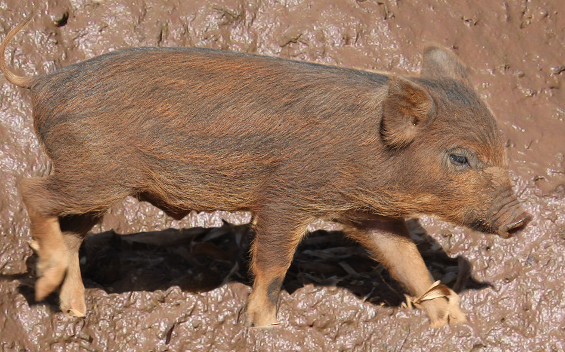

---
title: Técnicas de Programação
subtitle: 2026.2
...

# Avisos

- **Nesta disciplina, é proibida a utilização de ferramentas e plugins de IA generativa (IAg) em todas as atividades, pois a avaliação dos objetivos de aprendizagem é baseada no raciocínio lógico do próprio aluno.**

**Links importantes**:

- [Avisos (blackboard)](https://insper.blackboard.com/)
- [Exercícios (prairie learn)](https://us.prairielearn.com/pl/course_instance/220855)
<!-- - [Plano de aulas](./plano-de-aulas.xlsx)
- [Grupos do quiz1](./grupos-quiz1.csv) -->

# Equipe

-  **Marcio F. Stabile Jr.** (2026/2~)
-  **Igor Montagner** (~2026/1)
-  **Maciel Vidal** (2023/2) 
-  **Leo Montefusco Maximiano** (2026/2) 
-  **Lucas Grohmann Haro** (2026/2) 
-  **Cynthia Naoko Yasutake** (2025/2)
-  **Artur Alvares Cruz Lopes** (2025/2)
-  **Pedro Vaz Pertusi** (2025/1)
-  **Luca Feltrin** (2025/1)
-  **Eduardo Vaz** (2024/1)
- **Alexandre Magno** (2024/1)
-  **João Lucas Cadorniga** (2024/2)

# Mascote

Nossa disciplina tem um mascote: o **javaporco**. Ele foi escolhido em homenagem à qualidade do código Java desenvolvido nessa disciplina. (Créditos: [javaporco](https://flickr.com/photos/luizmrocha/4777371771), [lama](https://commons.wikimedia.org/wiki/File:Mud_closeup.jpg))

# Avaliações

Teremos os seguinte itens de avaliação

- $EX$ - Média de todos os exercícios
- $MQ$ - Média dos quizzes
- $AI$ - Avaliação Intermediária 
- $AF$ - Avaliação Final

A nota final $NF$ é calculada da seguinte maneira. 

$$
NF = 0.1 \times EX + AI \times 0.3 + AF \times 0.4 + MQ \times 0.2
$$

Com a condição de que $(2 \times AI + 3 \times AF)/5 \geq 4.5$. 

# Como usar o material

Nossas aulas estão divididas em 3 materiais principais:

1. **slides** usados nas partes expositivas das aulas. 
2. **handouts** contendo atividades feitas em aula e explicações adicionais. Estão em formato PDF. É possível usar tanto impresso quanto anotando o PDF digitalmente.
3. **exercícios práticos** no LeetCode específicos para cada aula.

Veja os vídeos abaixo para entender um pouco melhor a mudança para material impresso e também algumas dicas de como aproveitar melhor esse tipo de material. Temos tanto para uso em papel como digital via anotações no PDF.

<a class="button" href="https://youtu.be/8eoDvbbxYhE">Uso do material em Papel</a> <!-- <a class="button" href="#">Uso do material em PDF</a> -->

<!-- Além disso, também teremos exercícios de implementação gerais de cada assunto. Eles são listados no início de cada assunto.

1. **implementação** dos algoritmos no PrairieLearn. Objetivo é traduzir os algoritmos vistos em sala para *Java*.
2. **exercícios extras** em sites como LeetCode, hackerrank e etc. Úteis para praticar para prova e ter mais exemplos dos algoritmos e estruturas de dados sendo usados.  -->

<!-- **Cheat Sheets Java**: -->

<!-- - [Parte 1][pseudo-cheatsheet1]: Variáveis e Controle de fluxo -->

<!-- # Exercícios extras

**Busca binária**:

- [Insert position](https://leetcode.com/problems/search-insert-position/description/)
- [Smallest letter greater than target](https://leetcode.com/problems/find-smallest-letter-greater-than-target/description/)
- [Find peak element](https://leetcode.com/problems/find-peak-element/description/)

**Ordenação**:

- [Contains Duplicate](https://leetcode.com/problems/contains-duplicate/description/)
- [Missing Number](https://leetcode.com/problems/missing-number/description/)
- [Majority Element](https://leetcode.com/problems/majority-element/description/)

**Recursão**:

- [Find unique string](https://leetcode.com/problems/find-unique-binary-string/description/)

**Labirinto e caminhos**:

- https://leetcode.com/problems/number-of-islands/
- https://leetcode.com/problems/surrounded-regions/
- https://leetcode.com/problems/max-area-of-island/ -->

# Materiais antigos

Materiais anteriores estão disponíveis em 

- [https://igordsm.github.io/disciplina-tecprog/](https://igordsm.github.io/disciplina-tecprog/)
- [https://insper.github.io/tecnicas-de-programacao](https://insper.github.io/tecnicas-de-programacao). 
